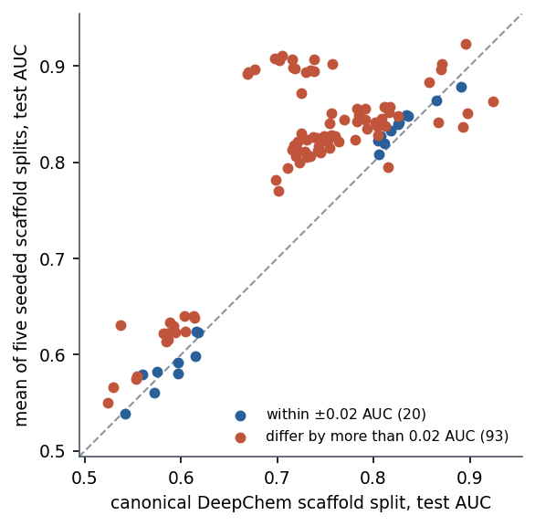
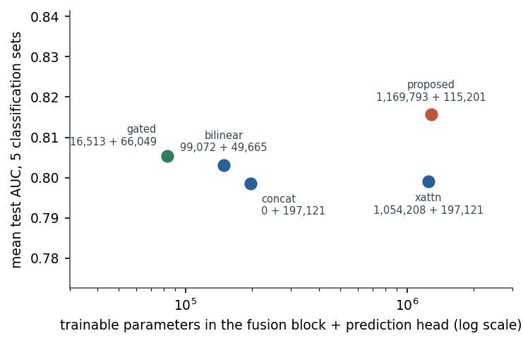
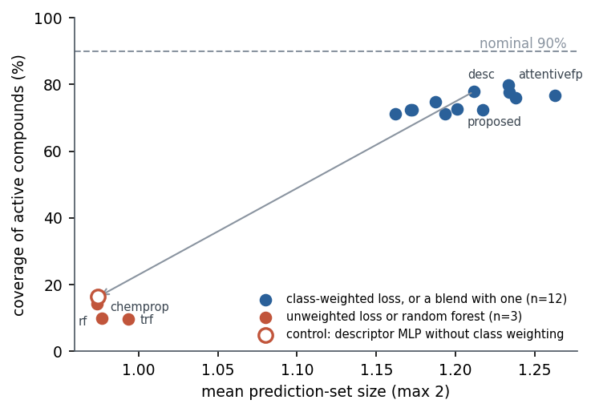
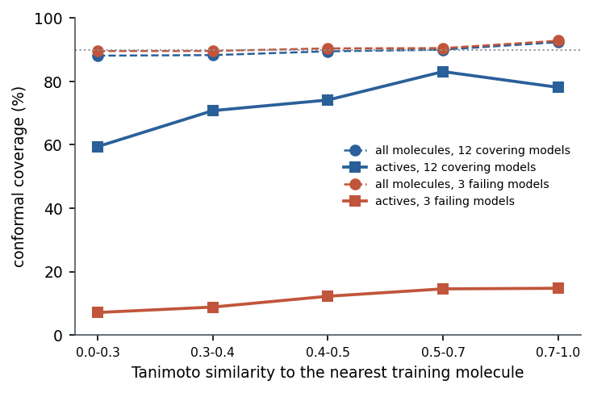

# Graph Neural Network and Transformer Fusion for Molecular Property Prediction under a Strict Evaluation Protocol: Notation Leakage, Descriptor Baselines and Conformal Coverage

<!--
Source of truth for the paper. `python -m scripts.make_latex` builds paper/latex/main.tex and
paper/overleaf_project.zip from this file; `python -m scripts.check_paper` asserts its numbers
against results/. Citations are [@bibkey]; tables need a "**Table N.**" caption line above them;
figures need a "**Figure N.**" caption paragraph below the image.
-->

## Abstract

Multi-view models that fuse a molecular graph, a SMILES language model and computed descriptors are proposed faster than they are independently evaluated. We evaluated a five-rung fusion ladder, two external baselines and an earlier multi-model pipeline on eight MoleculeNet datasets under one protocol: a canonical and five seeded scaffold splits, paired comparisons, Holm correction, across-dataset sign and Wilcoxon tests, and one fixed hyper-parameter setting. The protocol surfaced a label leak: in ClinTox and BBBP the notation of the SMILES string (aromatic or Kekulé) predicts the label, with AUC 1.000 for ClinTox toxicity. Only sequence models can read it. Canonicalising the strings lowered a frozen ChemBERTa model from 0.988 to 0.795 AUC on ClinTox and our three-view fusion model from 0.968 to 0.851. With the leak removed, the fusion model's advantage over a two-layer graph network was no longer significant across datasets (favoured on 7 of 8, p ≥ 0.070), no fusion variant outperformed a fingerprint-plus-descriptor MLP, and the gated and bilinear variants were worse than it on 7 of 8 datasets (Wilcoxon p = 0.023). Under marginal split conformal prediction on Tox21, three of fifteen models covered only 10–14% of active compounds; retraining the descriptor MLP without class weighting reproduced that failure (77.9% to 16.3%) at unchanged AUC. Deterministic APS and RAPS collapsed at two classes; their randomised forms did not. A change of accelerator, like a change of seed, moved about a quarter of single-split results by more than our practical threshold. All code and per-split metrics are public.

## 1. Introduction

A molecule can be represented as a graph, as a SMILES string or as a vector of computed properties, and each representation discards different information. Combining them is therefore a recurring idea in molecular property prediction: recent work fuses graph and language-model features [@prakash2023synfusion; @lu2024multimodal; @wang2024multimodal; @zhou2025mmfrl; @liu2026localglobal; @zhang2026sograph], aligns views with cross-attention [@zhang2024mvmrl], models second-order interactions between views with Kronecker or bilinear products [@jang2026krovex], and weights views per molecule with a learned gate, as in the interaction-prediction model of [@zhang2026molvisgnn].

Such proposals are usually evaluated on a few MoleculeNet datasets [@moleculenet2018] under a single scaffold split, against baselines taken from other papers. That design cannot separate a real improvement from a favourable split, a less-tuned baseline, or a difference smaller than run-to-run variation, and systematic studies have shown that simple fixed representations are often competitive once evaluation is controlled [@deng2023systematic]. We therefore fixed the evaluation protocol first and then used it to test a fusion architecture and its components.

This paper reports what that protocol found. Its contributions are:

1. **An evaluation protocol** for MoleculeNet property prediction that uses a canonical and five seeded scaffold splits, paired comparisons, Holm correction, across-dataset tests, an equivalence test, and one fixed hyper-parameter setting (Section 3).
2. **A label leak through SMILES notation** in ClinTox and BBBP that inflates sequence and fusion models by up to 0.19 AUC, with an audit that detects it and a correction that removes it (Section 4.1).
3. **A controlled case study of multi-view fusion.** With the leak removed, no fusion rung outperforms a fingerprint-plus-descriptor MLP and the advantage over a graph baseline is no longer significant across datasets (Section 5).
4. **Conformal prediction results for imbalanced endpoints**: minority-class coverage failure traced to class weighting with a control experiment, randomised versus deterministic adaptive sets at two classes, and coverage as a function of distance to the training set (Section 6).
5. **A measurement of device and seed variance** in these benchmarks' own units (Section 7), with practical recommendations (Section 8).

## 2. Related work

**Evaluation of molecular property prediction.** MoleculeNet [@moleculenet2018] standardised datasets and scaffold splits. Deng et al. [@deng2023systematic] showed, across many representations and repeated splits, that fixed descriptors and fingerprints often match learned representations, that statistical testing changes conclusions, and that label quality and splitting choices matter. Guo et al. [@guo2024scaffold] showed that scaffold splits can still overestimate performance on genuinely novel chemistry, and activity cliffs remain a known failure mode [@vantilborg2022cliffs; @qiao2025scage]. Demšar [@demsar2006] set out non-parametric tests for comparing learners over multiple datasets.

**Multi-view fusion.** Graph neural networks [@xu2019gin; @hu2020pretrain; @xiong2020attentivefp; @yang2019chemprop; @heid2024chemprop] and chemical language models [@chithrananda2020chemberta] have been combined by concatenation, attention and contrastive alignment [@prakash2023synfusion; @lu2024multimodal; @wang2024multimodal; @zhou2025mmfrl; @liu2026localglobal; @zhang2026sograph; @zhang2024mvmrl]. KROVEX [@jang2026krovex] fuses graph embeddings with statistically selected descriptors through a Kronecker product, and motif-level models such as AMCT [@yu2026amct] argue that substructure interactions matter. Table 1 lists the mechanisms we took from this work and how we implemented them. We implement mechanisms rather than complete published systems.

**Uncertainty quantification.** Calibration by temperature or Platt scaling [@guo2017calibration; @platt2000probabilities] and distribution-free conformal prediction [@vovk2022alrw; @angelopoulos2023gentle] are both used in cheminformatics [@norinder2014conformal; @cortesciriano2020conformal; @hirschfeld2020uq]. Class-conditional (Mondrian) conformal prediction is the established remedy for imbalanced bioactivity data [@norinder2017imbalanced; @sun2017mondrian], and Tursunbadalov and Tursunbadalov [@tursunbadalov2026quiet] recently quantified how badly marginal conformal prediction under-covers the minority class in MoleculeNet. Covariate shift between calibration and test molecules breaks the exchangeability conformal guarantees rely on [@laghuvarapu2023codrug]. Adaptive prediction sets are defined with a randomisation term [@romano2020aps; @angelopoulos2021raps], and conformalised quantile regression gives adaptive intervals [@romano2019cqr].

**Reproducibility.** Run-to-run variation in neural-network training arises from nondeterminism amplified by optimisation instability [@summers2021nondeterminism], from GPU-level randomness [@eryilmaz2024randomness] and from floating-point non-associativity [@shanmugavelu2024floating].

**Table 1.** Mechanisms taken from prior work and how they were implemented here.

| Source idea | Implementation in this work | Where evaluated |
|---|---|---|
| Kronecker or bilinear fusion of graph and descriptor features [@jang2026krovex] | Low-rank (rank 64) bilinear product for every pair of views, without descriptor selection | `bilinear` rung; `proposed`; Section 5.6 |
| Dual cross-attention over SMILES, graph and fingerprint [@zhang2024mvmrl] | Self-attention over the three view embeddings as tokens (2 layers, 4 heads) | `xattn` rung; `proposed` |
| Per-molecule gating of modalities [@zhang2026molvisgnn] | Softmax gate over the three view embeddings | `gated` rung; `proposed`; Section 5.4 |
| Atom- and motif-level interactions [@yu2026amct] | Bond features in message passing (GINE); a motif probe instead of a motif encoder | `gine` view; Section 5.7 |
| Activity cliffs as a failure mode [@vantilborg2022cliffs; @qiao2025scage] | Error analysis stratified by cliff membership | Section 6.7 |
| Calibration and conformal prediction [@guo2017calibration; @vovk2022alrw; @angelopoulos2023gentle] | Post-hoc calibration maps; split conformal prediction | Section 6 |

## 3. Methods

### 3.1 Datasets

We used eight MoleculeNet [@moleculenet2018] datasets as served by DeepChem 2.8.0 [@deepchem2019] (Table 2): Tox21 [@huang2016tox21], BBBP [@martins2012bbbp], ClinTox [@gayvert2016clintox], BACE [@subramanian2016bace] and SIDER [@kuhn2016sider] for classification, and ESOL [@delaney2004esol], Lipophilicity (AstraZeneca's ChEMBL deposition [@gaulton2017chembl]) and FreeSolv [@mobley2014freesolv] for regression. FreeSolv was loaded with DeepChem's SAMPL loader, because the FreeSolv loader serves an already standardised target and would report RMSE in no physical unit. Tox21 is sparsely measured: 15.3% of training labels and 23.9% of test labels on the canonical split are missing, and missing labels are masked out of every loss and metric. HIV was not included; eight datasets give an across-dataset sign-test floor of p = 0.0078, and HIV's size would have multiplied the compute of the full protocol.

**Table 2.** Datasets. Positive rate is the fraction of measured labels that are positive (range over tasks where there are several). Kekulé share is the fraction of aromatic molecules whose SMILES is written without lower-case aromatic atoms (Section 4.1).

<!-- BEGIN GENERATED: datasets_table -->
| Dataset | Molecules | Tasks | Type | Positive rate | Kekulé share |
|---|---|---|---|---|---|
| Tox21 | 7,823 | 12 | classification | 2.9–16.2% | 0.0% |
| BBBP | 2,039 | 1 | classification | 76.5% | 52.1% |
| ClinTox | 1,480 | 2 | classification | 7.6–93.6% | 8.7% |
| BACE | 1,513 | 1 | classification | 45.7% | 0.1% |
| SIDER | 1,427 | 27 | classification | 1.5–92.4% | 100.0% |
| ESOL | 1,128 | 1 | regression (logS) | — | 0.0% |
| Lipophilicity | 4,200 | 1 | regression (logD) | — | 0.2% |
| FreeSolv | 642 | 1 | regression (kcal·mol⁻¹) | — | 0.0% |
<!-- END GENERATED -->

### 3.2 Models

**Single views.** Each view is projected to a common 256-dimensional embedding and followed by an identical two-layer head (256 hidden units, dropout 0.2), so that single-view comparisons differ only in representation.

- *Graph:* a two-layer GIN [@xu2019gin] from our earlier pipeline (`gin_ref`, 207,360 encoder parameters), and a four-layer edge-aware GINE encoder [@hu2020pretrain] with residual connections and mean-plus-sum readout (`gine`, 1,070,852). Atoms carry 34 features and bonds 7, computed with RDKit 2025.03.5 [@rdkit].
- *Sequence:* the frozen ChemBERTa checkpoint `seyonec/ChemBERTa-zinc-base-v1` [@chithrananda2020chemberta] with CLS and masked-mean pooling over at most 128 tokens (`seq_frozen`), and the same model with LoRA adapters (rank 8, α 16) [@hu2022lora] (`lora`).
- *Descriptors:* a 1,024-bit Morgan fingerprint of radius 2 [@rogers2010ecfp] concatenated with 217 RDKit 2-D descriptors, fed to a two-layer MLP with batch normalisation (`desc`). Descriptors are median-imputed, standardised and clipped using training-split statistics only.

**Fusion.** The fusion models use the GINE, frozen-ChemBERTa and descriptor views. The five fusion rungs are described in Section 5.2.

**External baselines.** AttentiveFP [@xiong2020attentivefp] (four layers, two timesteps) was wrapped as a graph encoder and trained under our protocol, with the same projection, head, loss and hyper-parameters. Chemprop 2 [@heid2024chemprop; @yang2019chemprop] was run through its own command-line interface on our splits, with its own featurisation, target scaling, learning-rate schedule and early stopping, for 50 epochs and without class weighting. Chemprop is therefore a comparison of complete methods, not of architectures under one recipe.

**Earlier pipeline.** Our earlier pipeline contains a random forest on ECFP (`rf`), a GNN (`gnn`), a frozen-ChemBERTa head (`trf`), a stacking meta-learner fitted on out-of-fold predictions (`hybrid`) and a weighted ensemble (`ens`). It was run on five of the eight datasets.

### 3.3 Splits

We report two scaffold-split conventions. The *canonical* split is DeepChem's deterministic scaffold split (80/10/10), which assigns the largest Bemis–Murcko scaffold groups [@bemis1996frameworks] to training and the rarest to test; all acyclic molecules share one empty-scaffold group. The *seeded* splits (seeds 0–4) use a balanced random scaffold split: groups larger than half the validation or test quota go to training, the remaining groups are shuffled and dealt into 80/10/10, and each acyclic molecule forms its own group. No scaffold is shared between training and test in any split. On seeded splits 1 and 2 one SIDER task has no positive test molecule and is not scored.

### 3.4 Training and fitting discipline

Every neural model was trained with Adam (learning rate 10⁻³, weight decay 10⁻⁴, batch size 128) for at most 100 epochs, with early stopping on validation AUC or RMSE (patience 15), restoring the best epoch. Classification losses are masked binary cross-entropy with per-task positive-class weights computed from the training labels; regression uses masked mean squared error on standardised targets, and all regression metrics are reported in chemical units. All models use one initialisation seed (42); the five seeded splits vary the data partition, not the initialisation. The setting is recorded in `configs/shared.yaml`, and a check fails if it drifts from the trainers' defaults. No architecture, including ours, was tuned; an Optuna [@akiba2019optuna] study was implemented but not run, because tuning one arm of a comparison against fixed-setting baselines would confound architecture with search budget.

In the earlier pipeline the meta-learner, ensemble weights and decision thresholds are fitted on out-of-fold predictions over the training split. The validation split is used for early stopping and, in Section 6, as the calibration set; the test split is evaluated once.

### 3.5 Statistical comparisons

Splits differ in difficulty more than models differ from each other, so every comparison is paired within split and reported at three levels.

1. *Per dataset:* a paired t-test over the five seeded splits. With five splits a Wilcoxon test cannot reach p < 0.05, so the t-test is used, with its normality assumption.
2. *Per dataset, corrected:* Holm–Bonferroni correction [@holm1979] across the datasets in the comparison.
3. *Across datasets:* one test over the per-dataset mean differences, reported as a sign test, a Wilcoxon signed-rank test [@wilcoxon1945] on Cohen's *dz* (unit-free) and a Wilcoxon test on raw differences. The raw version ranks AUC differences against RMSE differences and is reported only for comparability with common practice [@demsar2006].

With eight datasets the sign test cannot go below p = 0.0078, and a 7–1 result gives p = 0.070; with six datasets the floor is p = 0.031. Where a model's ClinTox and BBBP results are excluded (Section 4.1), its comparisons run over the remaining six datasets and are marked *n* = 6. We ran several dozen across-dataset comparisons and did not correct across them, and the framing of this paper followed the results rather than a pre-registered hypothesis. The across-dataset p-values should therefore be read as exploratory. To claim that two models perform the same, we use an equivalence test (two one-sided tests [@schuirmann1987tost]): the 90% confidence interval of the paired difference must lie within the practical threshold of Section 3.6.

### 3.6 Practical threshold

We treat differences smaller than 0.02 AUC or 0.10 RMSE as too small to matter. These values were set from the across-split confidence intervals of the baseline models in our earlier pipeline, before the fusion experiments, so they are an empirical noise threshold rather than a power-based minimum detectable effect. A single RMSE threshold is applied across logS, logD and kcal·mol⁻¹, which treats a 0.10 error equally in all three units.

### 3.7 Uncertainty quantification

**Calibration.** For each classification model and task we fitted identity, temperature and Platt maps on the validation split and kept the one with the lowest validation expected calibration error (ECE, 15 equal-count bins, confidence of the predicted class). Our Platt map is fitted with balanced class weights, which shifts probabilities toward the minority class; we report it as implemented. Test ECE with and without the map was compared over the five seeded splits by the interval of the paired difference.

**Conformal prediction.** We used split conformal prediction [@vovk2022alrw; @angelopoulos2023gentle] at α = 0.1, with the validation split as the calibration set and the finite-sample quantile. For classification the default score is LAC (1 − p of the class) [@sadinle2019lac], applied to each task separately. Coverage, per-class coverage and mean set size are averaged over tasks and then over the five seeded splits. Class-conditional (Mondrian) prediction fits one quantile per class. APS [@romano2020aps] and RAPS (λ = 0.1, k_reg = 1) [@angelopoulos2021raps] were evaluated both in their randomised form and deterministically. For regression we compared the absolute residual, the residual normalised by the disagreement of the earlier pipeline's base models, and conformalised quantile regression (CQR) [@romano2019cqr] on a quantile version of the descriptor MLP. Because the calibration set is also the early-stopping set, the calibration scores are slightly optimistic, which biases test coverage downward.

### 3.8 Hardware and software

Models were trained with PyTorch 2.3.1 [@paszke2019pytorch], PyTorch Geometric 2.6.1 [@fey2019pyg], Transformers 4.43.4 [@wolf2020transformers], PEFT 0.12.0 [@mangrulkar2022peft] and scikit-learn 1.4.2 [@pedregosa2011sklearn]. The single views `gin_ref`, `gine` and `desc`, the cached fusion ladder, the no-graph ablation and all canonical-SMILES re-runs were trained on an Intel Core i7-9750H CPU. LoRA, the frozen ChemBERTa view, AttentiveFP, Chemprop, the T4 copies of the cached ladder (suffix `_gpu`), the rank sweep and the end-to-end ladder were trained on an NVIDIA T4 GPU in Google Colab. Comparisons between the two groups are cross-device; Section 7 measures what that costs.

## 4. Data and protocol audits

### 4.1 SMILES notation predicts the label in ClinTox and BBBP

A molecule with an aromatic ring can be written with lower-case aromatic atoms or in Kekulé form. Graph, fingerprint and descriptor featurisers parse both into the same molecule; a language model reads the characters. We audited, for every dataset, whether the notation of aromatic molecules predicts the label (`scripts/audit_notation.py`).

In six datasets one notation is used throughout (Kekulé share 0.0–0.2% or 100%), so notation carries no label information. ClinTox was assembled from two source lists: approved drugs, written in aromatic form, and drugs that failed clinical trials for toxicity, written in Kekulé form. Among its 1,105 aromatic molecules the single notation bit predicts CT_TOX with AUC 1.000 and FDA_APPROVED with AUC 0.995. BBBP mixes both conventions (52.1% Kekulé), and the bit predicts permeability with AUC 0.827.

To measure the effect we re-ran every CPU-trained model that reads SMILES on ClinTox and BBBP with RDKit-canonical strings, changing nothing else (Table 3). Canonicalisation lowered the frozen ChemBERTa view by 0.193 AUC on ClinTox and 0.076 on BBBP, and each fusion model by 0.041 to 0.150 AUC. The graph and descriptor views are unaffected by construction. On ClinTox every canonicalised fusion model scores below the two-layer GIN (0.820–0.863 against 0.897); on BBBP they land within 0.013 of it (0.893–0.910 against 0.906).

**Table 3.** Test AUC with raw and RDKit-canonical SMILES (mean of five seeded splits; paired t-test over splits). `seq only` is the frozen ChemBERTa view trained from cached embeddings.

<!-- BEGIN GENERATED: leakage_table -->
| Dataset | Model | Raw SMILES | Canonical SMILES | Change | p |
|---|---|---|---|---|---|
| ClinTox | seq only (frozen ChemBERTa) | 0.988 | 0.795 | -0.193 | 0.003 |
| ClinTox | `gated`, no graph | 0.983 | 0.840 | -0.144 | 0.062 |
| ClinTox | `concat` | 0.968 | 0.863 | -0.104 | 0.106 |
| ClinTox | `gated` | 0.985 | 0.851 | -0.134 | 0.011 |
| ClinTox | `xattn` | 0.964 | 0.837 | -0.127 | 0.016 |
| ClinTox | `bilinear` | 0.970 | 0.820 | -0.150 | 0.022 |
| ClinTox | `proposed` | 0.968 | 0.851 | -0.117 | 0.007 |
| ClinTox | `gin_ref`, reads no SMILES | 0.897 | 0.897 | — | — |
| ClinTox | `desc`, reads no SMILES | 0.841 | 0.841 | — | — |
| BBBP | seq only (frozen ChemBERTa) | 0.947 | 0.871 | -0.076 | 0.002 |
| BBBP | `gated`, no graph | 0.951 | 0.910 | -0.041 | 0.007 |
| BBBP | `concat` | 0.944 | 0.893 | -0.051 | 0.024 |
| BBBP | `gated` | 0.954 | 0.894 | -0.060 | 0.014 |
| BBBP | `xattn` | 0.946 | 0.895 | -0.051 | 0.004 |
| BBBP | `bilinear` | 0.950 | 0.902 | -0.047 | 0.007 |
| BBBP | `proposed` | 0.953 | 0.907 | -0.046 | 0.017 |
| BBBP | `gin_ref`, reads no SMILES | 0.906 | 0.906 | — | — |
| BBBP | `desc`, reads no SMILES | 0.907 | 0.907 | — | — |
<!-- END GENERATED -->

The corrected pipeline canonicalises SMILES for ClinTox and BBBP everywhere a sequence model reads them (`src/data/smiles.py`), and all CPU fusion results in this paper use canonical strings on those two datasets. The GPU-trained sequence models (the frozen and LoRA ChemBERTa views, the T4 ladder, the rank sweep and the end-to-end ladder) and the earlier pipeline's `trf`, `hybrid` and `ens` were not re-run. Their ClinTox and BBBP results are excluded, and their comparisons use the remaining six datasets.

### 4.2 Duplicate molecules with conflicting labels

Canonicalising the SMILES of each dataset reveals duplicates that raw strings hide (Table 4); five datasets have none. In BBBP, 10 of 60 duplicate groups carry contradictory labels. Aspirin, for example, appears twice, once labelled permeable and once not. All 19 ClinTox duplicate groups conflict, but they are the source-list artefact of Section 4.1: one drug entered once as approved (aromatic notation) and once as failed (Kekulé notation). Duplicate and contradictory labels in MoleculeNet were also reported by Deng et al. [@deng2023systematic].

**Table 4.** Duplicate molecules after canonicalisation, and duplicate groups whose copies fall in different parts of a split.

<!-- BEGIN GENERATED: duplicates_table -->
| Dataset | Rows | Unique molecules | Duplicate groups | Conflicting groups | Groups crossing splits (canonical / seeded 0–4) |
|---|---|---|---|---|---|
| BBBP | 2,039 | 1,975 | 60 | 10 | 0 / 1, 1, 2, 1, 2 |
| ClinTox | 1,480 | 1,461 | 19 | 19 | 0 / 0, 0, 0, 0, 0 |
| ESOL | 1,128 | 1,117 | 11 | 6 | 0 / 1, 1, 0, 0, 1 |
<!-- END GENERATED -->

On the canonical split no duplicate crosses train, validation and test, because DeepChem groups all acyclic molecules together. The seeded splits treat each acyclic molecule as its own group, so small acyclic duplicates can land on both sides: chloroform, dichloromethane, divinyl ether and 2-chloro-1,1,1-trifluoroethane in BBBP, and a hexitol recorded with two different solubilities in ESOL. This is a small leak (at most two molecules per split) that we report rather than correct, because changing the split would invalidate every archived result.

### 4.3 Two scaffold-split conventions

The canonical and seeded conventions are both called "scaffold split" but give different numbers. Over all 113 (model, classification dataset) pairs with results under both conventions, the seeded mean exceeded the canonical split in 101 cases (median difference +0.046 AUC, maximum 0.223), and 93 pairs differed by more than 0.02 AUC (Figure 1). The canonical split is systematically harder, as expected from assigning the rarest scaffolds to test. Numbers from the two conventions are not comparable, and a paper should state which one it uses.



**Figure 1.** Test AUC on the canonical DeepChem scaffold split against the mean of five seeded scaffold splits, for every (model, classification dataset) pair with both. Points above the diagonal scored lower on the canonical split. Results that read raw SMILES on ClinTox or BBBP are excluded.

### 4.4 Defects found in the earlier pipeline

Before any fusion experiment we re-ran our earlier pipeline under this protocol and found seven defects, each of which changed reported numbers: (1) Tox21's missing-label mask was not propagated, so unmeasured labels (23.9% of the canonical test labels) were trained and scored as negatives; (2) regression errors were reported in standardised rather than chemical units; (3) the final model was selected on the test split; (4) the meta-learner, ensemble weights, calibrators and thresholds were all fitted on the validation split and evaluated there; (5) the frozen ChemBERTa encoder ran with dropout active; (6) computed bond features were discarded before message passing; and (7) only the random forest was seeded. We also corrected two defects in our own evaluation code: a significance rule that compared a paired difference with the reference model's spread instead of the difference's own interval, and prediction heads sized from each encoder's output width, which gave the sequence view a 2.36-million-parameter head. Table 5 and Table 6 report the corrected models.

## 5. Case study: the multi-view fusion ladder

**Table 5.** Test AUC on the classification datasets: canonical split / mean ± 95% confidence interval over five seeded splits. "—" marks a model not run on that dataset or a result excluded because it read raw SMILES on ClinTox or BBBP.

<!-- BEGIN GENERATED: main_table_cls -->
| Model | Tox21 | BBBP | ClinTox | BACE | SIDER |
|---|---|---|---|---|---|
| RF (ECFP) | 0.731 / 0.805 ± 0.010 | 0.716 / 0.898 ± 0.042 | 0.770 / 0.845 ± 0.096 | — | — |
| GNN (pipeline) | 0.723 / 0.800 ± 0.025 | 0.676 / 0.896 ± 0.047 | 0.891 / 0.878 ± 0.080 | — | — |
| ChemBERTa head (pipeline) | 0.702 / 0.770 ± 0.015 | — | — | — | — |
| Stacking meta-learner | 0.752 / 0.822 ± 0.017 | — | — | — | — |
| Weighted ensemble | 0.751 / 0.822 ± 0.024 | — | — | — | — |
| GIN, 2-layer (`gin_ref`) | 0.729 / 0.811 ± 0.033 | 0.702 / 0.906 ± 0.038 | 0.870 / 0.897 ± 0.045 | 0.804 / 0.837 ± 0.060 | 0.587 / 0.622 ± 0.028 |
| GINE | 0.720 / 0.814 ± 0.029 | 0.698 / 0.908 ± 0.039 | 0.858 / 0.883 ± 0.061 | 0.806 / 0.808 ± 0.071 | 0.524 / 0.551 ± 0.032 |
| AttentiveFP | 0.781 / 0.823 ± 0.008 | 0.670 / 0.893 ± 0.027 | 0.895 / 0.923 ± 0.053 | 0.808 / 0.827 ± 0.064 | 0.560 / 0.579 ± 0.051 |
| Chemprop | 0.721 / 0.822 ± 0.017 | 0.669 / 0.892 ± 0.044 | 0.865 / 0.864 ± 0.044 | 0.755 / 0.840 ± 0.076 | 0.615 / 0.598 ± 0.010 |
| ChemBERTa, frozen | 0.699 / 0.782 ± 0.021 | — | — | 0.725 / 0.830 ± 0.044 | 0.576 / 0.583 ± 0.041 |
| ChemBERTa + LoRA | 0.711 / 0.794 ± 0.030 | — | — | 0.715 / 0.813 ± 0.063 | 0.597 / 0.581 ± 0.049 |
| ECFP + descriptor MLP (`desc`) | 0.757 / 0.828 ± 0.018 | 0.715 / 0.907 ± 0.033 | 0.867 / 0.841 ± 0.133 | 0.826 / 0.848 ± 0.068 | 0.613 / 0.640 ± 0.035 |
| Fusion: `concat` | 0.743 / 0.817 ± 0.027 | 0.730 / 0.893 ± 0.057 | 0.924 / 0.863 ± 0.146 | 0.792 / 0.844 ± 0.069 | 0.554 / 0.575 ± 0.022 |
| Fusion: `gated` | 0.749 / 0.827 ± 0.026 | 0.738 / 0.894 ± 0.041 | 0.756 / 0.851 ± 0.089 | 0.818 / 0.833 ± 0.076 | 0.582 / 0.622 ± 0.034 |
| Fusion: `xattn` | 0.755 / 0.815 ± 0.030 | 0.735 / 0.895 ± 0.032 | 0.893 / 0.837 ± 0.106 | 0.817 / 0.857 ± 0.070 | 0.597 / 0.592 ± 0.037 |
| Fusion: `bilinear` | 0.760 / 0.827 ± 0.029 | 0.757 / 0.902 ± 0.041 | 0.811 / 0.820 ± 0.149 | 0.816 / 0.851 ± 0.077 | 0.587 / 0.616 ± 0.049 |
| Fusion: `proposed` | 0.741 / 0.825 ± 0.021 | 0.739 / 0.907 ± 0.041 | 0.898 / 0.851 ± 0.088 | 0.811 / 0.857 ± 0.075 | 0.614 / 0.638 ± 0.011 |
| Fusion: `gated`, no graph | 0.763 / 0.821 ± 0.035 | 0.705 / 0.910 ± 0.031 | 0.826 / 0.840 ± 0.158 | 0.836 / 0.848 ± 0.089 | 0.616 / 0.624 ± 0.045 |
| Fusion: `concat`, end-to-end | 0.719 / 0.806 ± 0.022 | — | — | 0.793 / 0.834 ± 0.084 | 0.543 / 0.539 ± 0.032 |
| Fusion: `gated`, end-to-end | 0.731 / 0.823 ± 0.017 | — | — | 0.804 / 0.828 ± 0.084 | 0.604 / 0.640 ± 0.052 |
| Fusion: `proposed`, end-to-end | 0.718 / 0.817 ± 0.018 | — | — | 0.783 / 0.856 ± 0.082 | 0.537 / 0.631 ± 0.028 |
<!-- END GENERATED -->

**Table 6.** Test RMSE on the regression datasets (ESOL in logS, Lipophilicity in logD, FreeSolv in kcal·mol⁻¹): canonical split / mean ± 95% confidence interval over five seeded splits.

<!-- BEGIN GENERATED: main_table_reg -->
| Model | ESOL | Lipophilicity | FreeSolv |
|---|---|---|---|
| RF (ECFP) | 1.685 / 1.658 ± 0.441 | 0.960 / 1.004 ± 0.145 | — |
| GNN (pipeline) | 1.183 / 1.012 ± 0.131 | 0.790 / 0.805 ± 0.140 | — |
| ChemBERTa head (pipeline) | 1.412 / 1.496 ± 0.200 | 0.998 / 1.075 ± 0.084 | — |
| Stacking meta-learner | 1.200 / 0.987 ± 0.080 | 0.753 / 0.760 ± 0.123 | — |
| Weighted ensemble | 1.146 / 0.978 ± 0.098 | 0.753 / 0.760 ± 0.125 | — |
| GIN, 2-layer (`gin_ref`) | 1.175 / 1.125 ± 0.357 | 0.778 / 0.744 ± 0.159 | 2.429 / 1.526 ± 0.354 |
| GINE | 0.947 / 0.917 ± 0.108 | 0.720 / 0.743 ± 0.160 | 2.155 / 1.266 ± 0.257 |
| AttentiveFP | 0.844 / 0.818 ± 0.185 | 0.685 / 0.659 ± 0.069 | 2.199 / 1.127 ± 0.401 |
| Chemprop | 0.848 / 0.790 ± 0.150 | 0.740 / 0.641 ± 0.077 | 2.442 / 1.643 ± 0.321 |
| ChemBERTa, frozen | 1.362 / 1.432 ± 0.257 | 0.922 / 1.020 ± 0.125 | 3.196 / 2.176 ± 0.467 |
| ChemBERTa + LoRA | 1.194 / 1.114 ± 0.185 | 0.875 / 0.946 ± 0.135 | 3.179 / 1.835 ± 0.210 |
| ECFP + descriptor MLP (`desc`) | 0.782 / 0.772 ± 0.144 | 0.719 / 0.677 ± 0.014 | 2.059 / 0.970 ± 0.254 |
| Fusion: `concat` | 0.871 / 0.859 ± 0.119 | 0.729 / 0.685 ± 0.031 | 2.142 / 0.983 ± 0.224 |
| Fusion: `gated` | 0.932 / 0.835 ± 0.160 | 0.736 / 0.696 ± 0.021 | 2.173 / 1.104 ± 0.313 |
| Fusion: `xattn` | 0.871 / 0.850 ± 0.105 | 0.720 / 0.714 ± 0.027 | 2.169 / 0.942 ± 0.252 |
| Fusion: `bilinear` | 0.836 / 0.827 ± 0.141 | 0.732 / 0.684 ± 0.030 | 2.015 / 1.037 ± 0.366 |
| Fusion: `proposed` | 0.872 / 0.783 ± 0.102 | 0.709 / 0.689 ± 0.035 | 1.897 / 0.956 ± 0.269 |
| Fusion: `gated`, no graph | 0.778 / 0.867 ± 0.231 | 0.721 / 0.682 ± 0.021 | 2.009 / 0.980 ± 0.293 |
| Fusion: `concat`, end-to-end | 0.961 / 0.966 ± 0.153 | 0.762 / 0.721 ± 0.042 | 2.139 / 1.394 ± 0.356 |
| Fusion: `gated`, end-to-end | 0.912 / 0.918 ± 0.221 | 0.724 / 0.693 ± 0.034 | 2.155 / 1.311 ± 0.176 |
| Fusion: `proposed`, end-to-end | 0.941 / 0.843 ± 0.117 | 0.742 / 0.695 ± 0.008 | 1.929 / 1.002 ± 0.236 |
<!-- END GENERATED -->

### 5.1 Single views

No single view outperformed the two-layer GIN baseline after correction. `gine` improved on 0 of 8 datasets at five times the parameters, `desc` on 0 of 8 (favoured on 7 of 8 by mean; across datasets p = 0.070/0.055/0.078), and the sequence views on 0 of 6. The frozen ChemBERTa view was favoured on none of the six datasets it can be scored on (sign test p = 0.031) and was significantly worse on FreeSolv after correction. Against a matched frozen control, LoRA fine-tuning improved ESOL (Holm p = 0.0054) and no other dataset.

The descriptor view had the best mean on six of the eight datasets (Tox21, BACE, SIDER, ESOL, Lipophilicity, FreeSolv); GINE led on BBBP by 0.0005 AUC and the two-layer GIN on ClinTox. For the three regression targets the descriptors encode much of the physics: Delaney's ESOL equation is linear in four descriptors [@delaney2004esol], three of which (the octanol–water partition coefficient, molecular weight and rotatable-bond count) are in our descriptor set, and topological polar surface area alone correlates with FreeSolv hydration free energy at *r* = −0.736. The ordering of views did change between datasets, but once the notation leak was removed the sequence views led on none of them.

### 5.2 Fusion rungs

Five fusion strategies share one interface (Table 7). The fusion output feeds the same kind of two-layer head, but the head's input width follows the fusion output, so head size differs between rungs; Table 7 reports both.

**Table 7.** Fusion rungs for three 256-dimensional views. Head parameters are for a single-task head.

<!-- BEGIN GENERATED: rungs_table -->
| Rung | Mechanism | Fusion parameters | Output width | Head parameters |
|---|---|---|---|---|
| `concat` | concatenate the views | 0 | 768 | 197,121 |
| `gated` | per-molecule softmax gate over views | 16,513 | 256 | 66,049 |
| `xattn` | self-attention over the views as tokens | 1,054,208 | 768 | 197,121 |
| `bilinear` | low-rank product for each pair of views (rank 64) | 99,072 | 192 | 49,665 |
| `proposed` | `xattn`, then `bilinear` and `gated` in parallel | 1,169,793 | 448 | 115,201 |
<!-- END GENERATED -->

Before interpreting results we checked that each fusion block computes the function it claims. For a function of three views, the mixed difference *D* = *f*(a,b,c) − *f*(a′,b,c) − *f*(a,b′,c) + *f*(a′,b′,c) is zero for an additive function. At initialisation, max \|*D*\| was 2.4 × 10⁻⁷ for `concat` (numerical zero) and between 0.45 and 13 for the other rungs, a gap of more than six orders of magnitude (`scripts/check_mechanisms.py`). This checks the fusion block only. Every model has a non-linear head on top, so the full `concat` model can still learn interactions between views.

### 5.3 Results

Table 8 reports the across-dataset comparisons of the cached CPU ladder with ClinTox and BBBP on canonical SMILES.

**Table 8.** Across-dataset comparisons of the cached fusion ladder (*n* = 8): datasets favouring the first model, sign / Wilcoxon-*dz* / Wilcoxon-raw p-values, and datasets improved or degraded after Holm correction.

<!-- BEGIN GENERATED: ladder_table -->
| Comparison | Favoured | p (sign / dz / raw) | Holm improves / degrades |
|---|---|---|---|
| `proposed` vs `gin_ref` | 7/8 | 0.070 / 0.109 / 0.078 | 1 / 0 |
| `gated` vs `gin_ref` | 4/8 | 1.000 / 0.547 / 0.383 | 1 / 0 |
| `desc` vs `gin_ref` | 7/8 | 0.070 / 0.055 / 0.078 | 0 / 0 |
| `proposed` vs `desc` | 3/8 | 0.727 / 0.945 / 0.945 | 0 / 0 |
| `gated` vs `desc` | 1/8 | 0.070 / 0.023 / 0.023 | 0 / 0 |
| `concat` vs `desc` | 1/8 | 0.070 / 0.109 / 0.109 | 0 / 0 |
| `xattn` vs `desc` | 2/8 | 0.289 / 0.109 / 0.148 | 0 / 0 |
| `bilinear` vs `desc` | 1/8 | 0.070 / 0.023 / 0.023 | 0 / 0 |
| `proposed` vs `concat` | 6/8 | 0.289 / 0.055 / 0.055 | 1 / 0 |
| `proposed` vs `gated` | 6/8 | 0.289 / 0.039 / 0.039 | 0 / 0 |
<!-- END GENERATED -->

`proposed` was favoured over the two-layer GIN on 7 of 8 datasets, but no across-dataset statistic reached 0.05 (p = 0.070 / 0.109 / 0.078), and only FreeSolv improved after correction (0.956 against 1.526 kcal·mol⁻¹). The descriptor MLP had the same record against the GIN (7 of 8; p = 0.070 / 0.055 / 0.078) with no pretrained encoder and no graph library. No fusion rung outperformed the descriptor MLP. `proposed` was favoured over it on 3 of 8 datasets (p ≥ 0.727) and `xattn` on 2. `concat`, `gated` and `bilinear` were each favoured on 1 of 8, and `gated` and `bilinear` were significantly worse than the MLP on both Wilcoxon statistics (p = 0.023; sign test p = 0.070), with no single dataset surviving correction. Within the ladder, `proposed` was favoured over `concat` and over `gated` on 6 of 8 datasets each. Against `gated` both Wilcoxon statistics were significant (p = 0.039) but the sign test was not (p = 0.289) and no dataset survived correction; against `concat` no across-dataset statistic was significant (p ≥ 0.055) and SIDER improved after correction.

**Table 9.** `proposed` against the earlier pipeline's models on the datasets where they were run. `trf` and `hybrid` read raw SMILES on BBBP and ClinTox, so those comparisons use Tox21, ESOL and Lipophilicity only.

<!-- BEGIN GENERATED: pipeline_table -->
| Comparison | Datasets | Favoured | p (sign / dz / raw) | Holm improves / degrades |
|---|---|---|---|---|
| `proposed` vs `rf` | 5 | 5/5 | 0.062 / 0.062 / 0.062 | 2 / 0 |
| `proposed` vs `gnn` | 5 | 4/5 | 0.375 / 0.188 / 0.312 | 1 / 0 |
| `proposed` vs `trf` | 3 | 3/3 | 0.250 / 0.250 / 0.250 | 3 / 0 |
| `proposed` vs `hybrid` | 3 | 3/3 | 0.250 / 0.250 / 0.250 | 1 / 0 |
<!-- END GENERATED -->

`proposed` was favoured over the random forest on all five datasets (ESOL and Lipophilicity after correction), over the earlier GNN on 4 of 5 (ESOL after correction; the GNN led on ClinTox), and over the SMILES transformer and the stacking meta-learner on all three comparable datasets (all three and ESOL, respectively, after correction). With five or three datasets the across-dataset tests cannot reach 0.05: the smallest attainable sign-test p-values are 0.062 and 0.25. Every corrected improvement except the transformer's Tox21 result is on a regression dataset.



**Figure 2.** Mean test AUC over the five classification datasets (canonical SMILES for ClinTox and BBBP; five seeded splits) against the number of parameters in the fusion block plus prediction head, for each rung of the cached ladder. Labels give the fusion-block and head parameter counts. Paired comparisons are in Table 8.

End-to-end training of LoRA adapters inside the fusion model rather than reading cached embeddings did not improve the proposed model on any of the six datasets on which it can be compared (the end-to-end model was favoured on 0 of 6; p = 0.031 on all three statistics, the smallest attainable at *n* = 6; no dataset differed after correction). The end-to-end models were trained on a T4 and the cached model on CPU, so this comparison also crosses devices (Section 7).

### 5.4 Removing the graph view, and what the gate weights show

On every dataset the gate assigned the graph view 0.4–1.4% of its weight (mean over five splits). Retraining the gated model without the graph view produced no detectable change in accuracy (the model without the graph view was favoured on 5 of 8 datasets; p = 0.727 / 0.250 / 0.461; no dataset differed after correction) and cut training time from about 17 minutes to about 1.3 minutes per split on our CPU (Table 10). An equivalence test within ±0.02 AUC / ±0.10 RMSE, however, established equivalence on only 2 of 8 datasets (Tox21 and Lipophilicity; 90% interval inside the margin), so the ablation shows no detectable loss rather than demonstrated equivalence.

**Table 10.** Cost of the gated model with and without the graph view (Intel i7-9750H CPU, all eight datasets per split).

| | With graph view | Without graph view |
|---|---|---|
| Training time per split | 16–21 min | 1.2–1.8 min |
| Parameters (FreeSolv model) | 2,050,694 | 848,514 |
| Requires a graph library | yes | no |

Removing a view that carried at most 1.4% of the gate weight changed the remaining weights substantially: the descriptor weight rose on all eight datasets, from 0.23–0.80 to 0.81–0.97, and the three datasets on which the three-view gate had favoured the sequence view (BBBP, ClinTox and BACE) switched to the descriptor view. Gate weights are computed over unnormalised view embeddings and varied widely across splits (for example SIDER's sequence weight was 0.43 ± 0.34, mean and 95% interval over five splits). They describe how one trained model routed information, not how much each view matters. This agrees with the literature on attention weights as explanations [@jain2019attention; @wiegreffe2019attention].

### 5.5 External baselines

**Table 11.** External baselines (*n* = 8). AttentiveFP and Chemprop were trained on a T4 GPU, `gine`, `desc` and `proposed` on CPU, and `gin_ref_gpu` is the T4 copy of the GIN baseline; comparisons across the two groups are cross-device (Section 7).

<!-- BEGIN GENERATED: external_table -->
| Comparison | Favoured | p (sign / dz / raw) | Holm improves / degrades |
|---|---|---|---|
| AttentiveFP vs `gine` | 7/8 | 0.070 / 0.039 / 0.023 | 0 / 0 |
| AttentiveFP vs `gin_ref` (T4) | 6/8 | 0.289 / 0.195 / 0.109 | 0 / 0 |
| Chemprop vs `gin_ref` (T4) | 4/8 | 1.000 / 0.945 / 0.844 | 0 / 0 |
| Chemprop vs AttentiveFP | 4/8 | 1.000 / 1.000 / 1.000 | 0 / 0 |
| AttentiveFP vs `desc` | 2/8 | 0.289 / 0.148 / 0.312 | 0 / 0 |
| Chemprop vs `desc` | 2/8 | 0.289 / 0.109 / 0.383 | 0 / 1 |
| `proposed` vs AttentiveFP | 6/8 | 0.289 / 0.461 / 0.312 | 0 / 0 |
| `proposed` vs Chemprop | 6/8 | 0.289 / 0.250 / 0.312 | 2 / 0 |
<!-- END GENERATED -->

AttentiveFP (2,447,360 encoder parameters, 2.3 times GINE and 11.8 times the two-layer GIN) was favoured over our GINE encoder on 7 of 8 datasets, significant on the Wilcoxon statistics but not the sign test, with no dataset surviving correction. Neither AttentiveFP nor Chemprop differed from the two-layer GIN across datasets, and neither outperformed the descriptor MLP; the MLP was favoured over each on 6 of 8 datasets and outperformed Chemprop on FreeSolv after correction. Chemprop's FreeSolv error (1.64 kcal·mol⁻¹ against 0.97 for the MLP) is consistent with its recipe being poorly suited to that small dataset in 50 epochs, so this single result should not be read as a statement about the architecture. `proposed` was favoured over AttentiveFP and over Chemprop on 6 of 8 datasets each, with no across-dataset statistic significant (p ≥ 0.250); against Chemprop, SIDER and FreeSolv improved after correction.

### 5.6 Which mechanism separates from concatenation

We compared the mechanisms in three settings: the cached ladder on CPU (*n* = 8, canonical SMILES), the same cached ladder trained on a T4 (*n* = 6) and the end-to-end ladder with LoRA adapters (*n* = 6) (Table 12).

**Table 12.** Mechanism comparisons: datasets favouring the first model and Wilcoxon-*dz* p-value.

<!-- BEGIN GENERATED: mechanism_table -->
| Comparison | cached, CPU | cached, T4 | end-to-end, T4 |
|---|---|---|---|
| `bilinear` vs `concat` | 6/8, p = 0.312 | 6/6, p = 0.031 | 6/6, p = 0.031 |
| `xattn` vs `concat` | 5/8, p = 0.742 | 4/6, p = 0.219 | 3/6, p = 0.438 |
| `proposed` vs `bilinear` | 6/8, p = 0.195 | 3/6, p = 1.000 | 4/6, p = 0.438 |
| `proposed` vs `xattn` | 6/8, p = 0.078 | 5/6, p = 0.219 | 6/6, p = 0.031 |
<!-- END GENERATED -->

Bilinear fusion separated from concatenation in both T4 settings, favoured on all six datasets with the smallest p-value attainable at *n* = 6 (0.031). It did not separate on the CPU ladder once ClinTox and BBBP were canonicalised (6 of 8, p = 0.312): it lost to `concat` on ClinTox in all five splits (0.820 against 0.863 AUC) and was favoured on 5 of the 6 datasets that the T4 settings cover. Cross-attention separated from concatenation in no setting. `proposed` separated from `bilinear` in no setting on the unit-free statistics (on the CPU ladder only the raw-difference Wilcoxon reached p = 0.039; sign p = 0.289, *dz* p = 0.195) and from `xattn` only end-to-end. With three settings, four comparisons, no correction across them and the T4 results at the floor of the test, we read the bilinear advantage as suggestive rather than established, and the rank sweep below weakens it further.

**Rank sweep.** The bilinear rank *r* sets the size of the second-order term (two 256 × *r* projections per view pair). Every result above used *r* = 64, chosen without tuning, so we trained *r* ∈ {16, 32, 128} on the T4 under otherwise identical conditions (Table 13). No pair of ranks differed on any statistic (all p ≥ 0.094; *n* = 6). Against `concat`, only *r* = 64 reached the *n* = 6 floor of p = 0.031, while *r* = 16, 32 and 128 were favoured on 4, 5 and 5 of 6 datasets with p between 0.062 and 0.69. Because the ranks cannot be told apart, the significance of the *r* = 64 result should not be attributed to that rank. This is the error Gelman and Stern describe: the difference between "significant" and "not significant" is not itself significant [@gelman2006difference]. SIDER shows the largest bilinear advantage at every rank, and the paired differences on the remaining datasets are small relative to the practical threshold.

**Table 13.** Bilinear rank sweep on the T4 cached ladder (*n* = 6): comparison with `concat` and with *r* = 64.

<!-- BEGIN GENERATED: rank_table -->
| Rank | Fusion parameters | vs `concat`: favoured, sign / dz / raw p | vs r = 64: favoured, dz p |
|---|---|---|---|
| 16 | 24,768 | 4/6, 0.688 / 0.219 / 0.438 | 1/6, 0.156 |
| 32 | 49,536 | 5/6, 0.219 / 0.062 / 0.156 | 2/6, 0.156 |
| 64 | 99,072 | 6/6, 0.031 / 0.031 / 0.031 | — |
| 128 | 198,144 | 5/6, 0.219 / 0.094 / 0.219 | 3/6, 0.438 |
<!-- END GENERATED -->

### 5.7 A motif probe

The atom-and-motif idea of AMCT [@yu2026amct] suggested a sixth view built from BRICS fragments [@degen2008brics] and Murcko scaffolds [@bemis1996frameworks]. Instead of building it we ran a probe: fingerprint-plus-descriptor features, motif indicators, and both, each scored by one untuned linear model (logistic regression or ridge regression) on the same splits, with the motif vocabulary built from training molecules only (Table 14). The linear `ECFP+desc` arm shares the descriptor view's features but not its model. The trained MLP outperforms it by 0.069 AUC on Tox21 and 0.181 RMSE on Lipophilicity, so the probe's numbers are comparable only within Table 14.

**Table 14.** Motif probe: mean over five seeded splits (AUC or RMSE). The change column is the paired difference from adding motifs to `ECFP+desc`, with its 95% interval (positive favours adding motifs).

<!-- BEGIN GENERATED: motif_table -->
| Dataset | Metric | `ECFP+desc` | Motifs | Both | Change from adding motifs | BRICS fragments seen in training |
|---|---|---|---|---|---|---|
| Tox21 | AUC | 0.759 | 0.653 | 0.760 | +0.001 ± 0.002 | 58% |
| BBBP | AUC | 0.880 | 0.776 | 0.880 | -0.000 ± 0.004 | 61% |
| ClinTox | AUC | 0.850 | 0.738 | 0.855 | +0.005 ± 0.006 | 62% |
| BACE | AUC | 0.849 | 0.819 | 0.846 | -0.003 ± 0.011 | 92% |
| SIDER | AUC | 0.611 | 0.590 | 0.614 | +0.003 ± 0.004 | 61% |
| ESOL | RMSE | 0.903 | 2.383 | 0.901 | +0.002 ± 0.023 | 31% |
| Lipophilicity | RMSE | 0.858 | 1.006 | 0.877 | -0.020 ± 0.014 | 84% |
| FreeSolv | RMSE | 1.036 | 3.438 | 1.000 | +0.037 ± 0.077 | 24% |
<!-- END GENERATED -->

Motif indicators alone carried real but weaker signal: they lost to `ECFP+desc` on 8 of 8 datasets (sign test p = 0.0078), with five datasets surviving correction. Adding them changed nothing measurable: the combination was favoured on 5 of 8 datasets (p = 0.73), and its only uncorrected per-dataset difference was a loss of 0.020 logD on Lipophilicity (p = 0.0195; Holm p = 0.156). On the canonical split, where there is no interval, motifs alone beat `ECFP+desc` on BACE (0.7667 against 0.7529) and SIDER (0.5826 against 0.5783), and the combination improved 7 of 8 numbers. The conclusion rests on the seeded splits. A scaffold split guarantees that no ring-bearing test molecule shares a Murcko scaffold with training, so scaffold indicators cannot transfer. BRICS fragments transfer partially, from 95% of a molecule's fragments seen in training on the best BACE split to 16% on the worst FreeSolv split. Coverage tracks the number of fragments per molecule (*r* = 0.93 over 48 dataset–split pairs). A linear readout is a lower bound on what a trained motif encoder could extract.

## 6. Calibration and conformal prediction

### 6.1 Post-hoc calibration

Over 51 (model, classification dataset) pairs, fitting a calibration map on the validation split reduced test ECE by more than its interval on 17, increased it on 1 (Chemprop on SIDER, 0.106 to 0.113) and left it within the interval on the rest. Raw-SMILES results on ClinTox and BBBP are excluded, and the canonical-SMILES CPU models are included. Improvement was not confined to the worst-calibrated models (median raw ECE 0.086 where the map helped, 0.089 elsewhere), and with this many pairs a few verdicts are expected by chance. The balanced class weighting of our Platt map (Section 3.7) is one reason a map can worsen calibration on imbalanced data.

### 6.2 Minority-class coverage under marginal conformal prediction

Split conformal prediction was first validated on exchangeable synthetic data with 8% positives (`scripts/validate_conformal.py`): at a 90% target, coverage was 89.9% for regression intervals, 90.0% for marginal binary sets and 90.4% for actives under class-conditional sets. On Tox21 at α = 0.1, overall coverage ranged from 89.4% to 91.0% across the fifteen models (Table 15). Coverage of active compounds did not: three models covered 9.7–14.1% of actives with mean set sizes of 0.97–0.99, while the other twelve covered 71.1–79.8% with set sizes of 1.16–1.26.

**Table 15.** Split conformal prediction on Tox21 at a nominal 90% (LAC score; mean over 12 tasks and five seeded splits). Class-conditional results fit one quantile per class. `desc (no class weighting)` is the control described in the text.

<!-- BEGIN GENERATED: conformal_table -->
| Model | Class-weighted loss | Coverage | Actives covered | Set size | Actives, class-conditional | Set size, class-conditional |
|---|---|---|---|---|---|---|
| ChemBERTa head (pipeline) | no | 91.0% | 9.7% | 0.99 | 90.0% | 1.52 |
| Random forest (pipeline) | balanced trees | 90.7% | 9.8% | 0.98 | 91.1% | 1.52 |
| Chemprop | no | 90.6% | 14.1% | 0.97 | 90.7% | 1.44 |
| `desc` (no class weighting) | no | 90.7% | 16.3% | 0.97 | 89.2% | 1.41 |
| `gated`, no graph | yes | 89.9% | 71.1% | 1.16 | 88.4% | 1.40 |
| `concat` (T4) | yes | 89.8% | 71.3% | 1.19 | 88.9% | 1.42 |
| GNN (pipeline) | yes | 90.0% | 72.3% | 1.22 | 89.6% | 1.47 |
| Weighted ensemble | blend of rf, gnn, trf | 89.8% | 72.4% | 1.17 | 90.3% | 1.44 |
| `gated` | yes | 90.3% | 72.4% | 1.17 | 88.8% | 1.40 |
| `proposed` (T4) | yes | 89.4% | 72.7% | 1.20 | 90.1% | 1.42 |
| Stacking meta-learner | balanced meta-learner | 90.2% | 74.9% | 1.19 | 90.5% | 1.47 |
| `xattn` (T4) | yes | 90.1% | 76.1% | 1.24 | 89.6% | 1.42 |
| `gin_ref` (T4) | yes | 89.8% | 76.8% | 1.26 | 87.0% | 1.42 |
| `bilinear` (T4) | yes | 90.4% | 77.7% | 1.23 | 88.5% | 1.40 |
| `desc` | yes | 90.0% | 77.9% | 1.21 | 90.6% | 1.41 |
| AttentiveFP | yes | 90.3% | 79.8% | 1.23 | 88.2% | 1.40 |
<!-- END GENERATED -->

The three failing models are the random forest, the SMILES transformer of the earlier pipeline and Chemprop. Two were trained without class re-weighting, and the random forest's balanced class weights barely move vote-fraction probabilities. Ten of the twelve covering models were trained with a class-weighted loss. The other two, the weighted ensemble and the stacking meta-learner, combine the class-weighted GNN with the two failing pipeline models, and the meta-learner is itself fitted with balanced class weights. To separate training objective from architecture, we retrained the descriptor MLP without class weighting and left everything else unchanged. Its AUC was unchanged (0.831 against 0.828), but active coverage fell from 77.9% to 16.3% and mean set size from 1.21 to 0.97, moving it from the covering group to the failing group (Figure 3). Minority coverage under marginal conformal prediction therefore depends on how the minority class is weighted in training, not on the model family. A small mean set size is a symptom of the same cause and does not require test labels to compute, but it is not an independent predictor. Class-conditional conformal prediction restored active coverage to 87.0–91.1% for every model, including the control (89.2%), at larger mean set sizes (1.40–1.52).

This failure and its class-conditional remedy are established for imbalanced bioactivity data [@norinder2017imbalanced; @sun2017mondrian], and Tursunbadalov and Tursunbadalov [@tursunbadalov2026quiet] quantified it on MoleculeNet across three model types, explaining its size with a conservation identity. Our measurement extends theirs to fifteen models and adds the class-weighting control.



**Figure 3.** Mean prediction-set size against coverage of active compounds for fifteen models on Tox21 under marginal split conformal prediction at a nominal 90%. The open marker is the descriptor MLP retrained without class weighting; the arrow joins it to the same model trained with class weighting.

### 6.3 Temperature scaling and binary conformal sets

For a binary task with the LAC score, temperature scaling cannot change the prediction set. The score is 1 − *p* for the positive class and *p* for the negative class. The temperature map *g*(*p*) = σ(logit(*p*)/*T*) is strictly increasing and satisfies *g*(1 − *p*) = 1 − *g*(*p*), so both scores transform by the same increasing function. The conformal quantile of the transformed scores is the transformed quantile, so every comparison between a score and the threshold is unchanged. This follows from the invariance of split conformal prediction to strictly monotone transformations of the score [@angelopoulos2023gentle]. We confirmed it empirically for the earlier pipeline's random forest, GNN and ensemble on Tox21, BBBP and ClinTox: the sets were identical for every task and split, while individual probabilities moved by up to 0.26 (`scripts/validate_conformal.py`). Temperature scaling is therefore unnecessary before building binary LAC sets, though it can still improve the probabilities themselves. Platt scaling has an intercept, is not symmetric, and does change the sets; our class-balanced Platt map raised active coverage of the random forest to 85.7%, but without any guarantee.

### 6.4 Adaptive prediction sets at two classes

APS and RAPS are defined with a randomisation term [@romano2020aps; @angelopoulos2021raps]. Implemented deterministically, both collapsed at two classes: the lower-ranked class always scores 1.0, and when the conformal quantile reaches 1.0 every set contains both classes (Table 16). With randomisation both behaved as intended, with coverage at the nominal level and sets slightly larger than LAC's, and covered actives slightly better than LAC. Deterministic RAPS was identical to deterministic APS for these models. Tursunbadalov and Tursunbadalov [@tursunbadalov2026quiet] likewise report a working APS at two classes on BBBP.

**Table 16.** LAC, APS and RAPS on Tox21 at a nominal 90% (mean over 12 tasks and five seeded splits; CPU-trained models).

<!-- BEGIN GENERATED: aps_table -->
| Model | Score | Coverage | Actives covered | Mean set size |
|---|---|---|---|---|
| `desc` | LAC | 90.0% | 77.9% | 1.21 |
| `desc` | APS, deterministic | 99.1% | 97.6% | 1.93 |
| `desc` | APS, randomised | 90.1% | 81.3% | 1.32 |
| `desc` | RAPS, deterministic | 99.1% | 97.6% | 1.93 |
| `desc` | RAPS, randomised | 90.0% | 79.5% | 1.27 |
| `gin_ref` | LAC | 89.8% | 77.1% | 1.25 |
| `gin_ref` | APS, deterministic | 99.2% | 97.0% | 1.93 |
| `gin_ref` | APS, randomised | 90.1% | 81.8% | 1.36 |
| `gin_ref` | RAPS, deterministic | 99.2% | 97.0% | 1.93 |
| `gin_ref` | RAPS, randomised | 89.9% | 80.0% | 1.31 |
<!-- END GENERATED -->

### 6.5 Regression intervals

Table 17 compares interval scores on ESOL. The comparison is across models: the absolute-residual and normalised scores are shown for the model they were run on, and CQR requires its own quantile model.

**Table 17.** Split conformal intervals on ESOL at a nominal 90% (mean over five seeded splits).

<!-- BEGIN GENERATED: regression_table -->
| Model | Score | Coverage | Mean width (logS) | Width s.d. |
|---|---|---|---|---|
| `desc` | absolute residual | 85.1% | 2.215 | 0.000 |
| ensemble (`ens`) | absolute residual | 94.6% | 4.153 | 0.000 |
| ensemble (`ens`) | residual / base-model disagreement | 91.9% | 7.071 | 3.979 |
| quantile descriptor MLP | CQR | 87.7% | 2.509 | 0.821 |
<!-- END GENERATED -->

The absolute residual gives every molecule the same interval. Normalising by base-model disagreement made widths vary but widened the ensemble's mean interval 1.7-fold. CQR produced varying widths at a mean width close to the `desc` model's constant interval, but under-covered by 2.3 points on ESOL, 2.2 on Lipophilicity and 4.2 on FreeSolv, consistent with the exchangeability violation measured next. We did not test whether widths track per-molecule error, so we do not claim that they do.

### 6.6 Coverage and distance from the training set

We binned Tox21 test molecules by Tanimoto similarity of their ECFP to the nearest training molecule and computed coverage per bin, separately for the two groups of Section 6.2 (Table 18, Figure 4; six splits).

**Table 18.** Tox21 conformal coverage by similarity to the nearest training molecule (nominal 90%).

<!-- BEGIN GENERATED: distance_table -->
| Similarity | Mean molecules | Overall (12 covering) | Actives (12 covering) | Overall (3 failing) | Actives (3 failing) |
|---|---|---|---|---|---|
| 0.0-0.3 | 74 | 88.1% | 59.4% | 89.6% | 7.1% |
| 0.3-0.4 | 161 | 88.3% | 70.8% | 89.6% | 8.8% |
| 0.4-0.5 | 179 | 89.5% | 74.1% | 90.4% | 12.2% |
| 0.5-0.7 | 255 | 90.0% | 83.1% | 90.5% | 14.5% |
| 0.7-1.0 | 114 | 92.4% | 78.1% | 92.8% | 14.7% |
<!-- END GENERATED -->

For the twelve covering models, overall coverage rose from 88.1% for the most novel molecules to 92.4% for close analogues, and active coverage from 59.4% to a peak of 83.1% at similarity 0.5–0.7. The three failing models covered 7–15% of actives in every band, including close analogues. Distance from the training set therefore degrades coverage for all models, consistent with a violation of exchangeability [@laghuvarapu2023codrug]. It does not explain the difference between the groups.



**Figure 4.** Tox21 conformal coverage against Tanimoto similarity to the nearest training molecule, for all molecules (dashed) and active compounds (solid), separately for the twelve covering and the three failing models of Section 6.2. The dotted line is the nominal 90%.

### 6.7 Activity cliffs

We defined a test molecule to be on a cliff if another molecule in the dataset lies within ECFP Tanimoto similarity 0.9 and carries the opposite label, a looser definition than the potency-based cliffs of van Tilborg et al. [@vantilborg2022cliffs]. Splits with fewer than ten cliff molecules were skipped (Table 19).

**Table 19.** AUC on cliff and non-cliff test molecules (similarity threshold 0.9). BACE results average the three seeded splits with at least ten cliff molecules; Tox21 averages all five.

<!-- BEGIN GENERATED: cliff_table -->
| Dataset (cliff / non-cliff molecules; splits) | Model | Cliff AUC | Non-cliff AUC | Difference |
|---|---|---|---|---|
| BACE (13 / 139; 3 splits) | `desc` | 0.503 | 0.845 | 0.342 |
| BACE (13 / 139; 3 splits) | `gated` | 0.534 | 0.824 | 0.291 |
| Tox21 (34 / 749; 5 splits) | `desc` | 0.715 | 0.833 | 0.118 |
| Tox21 (34 / 749; 5 splits) | `gated` | 0.688 | 0.832 | 0.144 |
<!-- END GENERATED -->

Both models were near chance on BACE cliff molecules and markedly worse on Tox21 cliff molecules. With 10–17 cliff molecules per BACE split and no intervals, these results are descriptive, and the direction agrees with van Tilborg et al.

## 7. Device and seed variance

We trained five models (`gin_ref` and the four cached fusion rungs with a graph view) twice with identical code, seed and split indices, once on the CPU and once on a T4 GPU. Of 240 test metrics, 4 were identical; the median absolute difference was 0.017 and the mean 0.033 (maximum 0.451 RMSE). Initial weights match across devices, but dropout masks are drawn on the device, so the two runs follow different random streams. Scaled by the practical threshold of Section 3.6 (Table 20), 58 of 240 single-split results (24%) and 7 of 40 canonical-split results moved by more than the threshold, but only 1 of 40 five-split means did. Under the paired tests of Section 3.5 the device effect was not detectable for any of the five models.

To separate the device from the random stream, we also retrained two CPU models (`desc` and `fuse_gated_nograph`) with seed 43 instead of 42 on the same CPU. Changing the seed moved results as much as changing the device: 25 of 96 single-split results (26%) and 7 of 16 canonical-split results exceeded the threshold (median absolute difference 0.015), and none of the 16 five-split means did. The device effect is therefore of the same size as ordinary seed variance, which is what a change of random stream would produce.

**Table 20.** Absolute change in test metrics between two otherwise identical trainings, in multiples of the practical threshold (0.02 AUC, 0.10 RMSE).

<!-- BEGIN GENERATED: device_table -->
| Change | Models | Canonical split: median / max | Canonical over threshold | All single splits over threshold | Five-split mean: median / max | Five-split means over threshold |
|---|---|---|---|---|---|---|
| device: CPU vs T4 | 5 | 0.34 / 2.16 | 7 of 40 | 58 of 240 | 0.26 / 1.00 | 1 of 40 |
| seed: 42 vs 43, same CPU | 2 | 0.76 / 1.92 | 7 of 16 | 25 of 96 | 0.21 / 0.53 | 0 of 16 |
<!-- END GENERATED -->

These results agree with reports of run-to-run variation from nondeterminism [@summers2021nondeterminism; @eryilmaz2024randomness; @shanmugavelu2024floating]. A quarter of single-split results in these benchmarks change by more than the practical threshold under a change of device or seed alone, and averaging over five splits largely, though not always, removes the effect. Benchmark tables should record the device, and single-split comparisons should not be made across devices.

## 8. Recommendations

For training and model selection:

1. **Audit how inputs are written, not only what they contain.** Sequence models read the notation of a SMILES string. In ClinTox and BBBP notation predicts the label; canonicalise strings or audit notation before training a language model (Section 4.1).
2. **Include a fingerprint-plus-descriptor baseline.** In this study it had the best mean of any single view on six of eight datasets, and no fusion model outperformed it (Sections 5.1 and 5.3).
3. **Try the cheaper configuration first.** Dropping the graph view reduced training time roughly thirteen-fold with no detectable loss (Section 5.4), although equivalence was not established on every dataset.
4. **Fix one hyper-parameter setting across every compared model,** or tune all of them with the same budget (Section 3.4).

For reporting:

1. **State the split convention and report more than one split.** The canonical and seeded scaffold conventions differ by up to 0.223 AUC on the same model (Section 4.3).
2. **Record the accelerator and average over splits** (Section 7).
3. **Report paired, corrected per-dataset tests together with across-dataset tests, and test equivalence before claiming it** (Sections 3.5 and 5.4).
4. **Treat untuned constants as hyper-parameters.** A significant result at one rank, among ranks that cannot be told apart, is not evidence for that rank (Section 5.6).

For uncertainty estimates:

1. **Report per-class coverage on imbalanced endpoints and use class-conditional conformal prediction** [@norinder2017imbalanced; @sun2017mondrian]. Minority coverage depends on class weighting in training (Section 6.2).
2. **Use the randomised forms of APS and RAPS** (Section 6.4).
3. **Temperature scaling is unnecessary before binary LAC conformal sets** (Section 6.3).

## 9. Limitations

- **No hyper-parameter tuning.** Absolute numbers are untuned; a tuned model would likely score higher.
- **Partial re-run after the leakage finding.** Only CPU-trained models were re-run with canonical SMILES. GPU-trained sequence models and the earlier pipeline's `trf`, `hybrid` and `ens` are compared on six datasets (three for the pipeline comparisons), which lowers statistical power.
- **Head-size confound in the ladder.** Head width follows fusion output width (Table 7), so rungs differ in head capacity as well as mechanism.
- **Exploratory statistics.** Across-dataset tests are not corrected across the many comparisons reported, and five splits give low per-dataset power.
- **Calibration set equals the early-stopping set,** which biases conformal coverage downward (Section 3.7).
- **Cross-device comparisons.** Comparisons with AttentiveFP, Chemprop and the T4-trained models mix devices (Sections 3.8 and 7).
- **Chemprop was run with its own recipe,** so its comparison is between complete methods.
- **Implemented mechanisms, not published systems.** `xattn` and `bilinear` implement ideas from MvMRL and KROVEX, not those systems.
- **Small duplicate leak in the seeded splits** (Section 4.2).
- **Small, loosely defined cliff sets** (Section 6.7).
- **Motif probe is a lower bound,** because a trained motif encoder was not built (Section 5.7).

## 10. Conclusion

Applying one strict protocol to a multi-view fusion architecture and its components produced mostly negative but useful results. The largest effect in the study was not architectural. In ClinTox and BBBP the notation of the SMILES string predicts the label, which inflated every sequence-reading model by up to 0.19 AUC. With that leak removed, no fusion variant outperformed a fingerprint-plus-descriptor MLP, and the advantage over a two-layer graph network was no longer significant across datasets. Under marginal conformal prediction, coverage of active compounds on imbalanced Tox21 depended on class weighting during training rather than on model family. Adaptive prediction sets need their randomisation at two classes, and single-split results vary with the device and seed. The protocol and code are public so that these checks can be applied to other architectures.

## Declarations

**Data availability.** All datasets are public MoleculeNet benchmarks obtained through DeepChem 2.8.0. Per-split test and validation metrics for every model, the code that generates the split indices, and all derived statistics are in the code repository.

**Code availability.** Code, configuration and archived metrics are available at <https://github.com/ItisAarya/molecular-property-prediction-public> and archived on Zenodo (<https://doi.org/10.5281/zenodo.22734878>). Per-split predictions are not stored in the repository; the CPU-trained models regenerate them by re-training, and predictions for the GPU-trained models are available from the author on request.

**Competing interests.** The author declares no competing interests.

**Funding.** This work received no external funding.

**Author contributions.** A.S. designed the study, wrote the code, ran the experiments, analysed the results and wrote the manuscript.

## References

<!-- Typeset by BibTeX from paper/references.bib; every entry there is cited above. -->

## Appendix A. Reproducing the results

```
python -m scripts.check_configs       # configuration matches trainer defaults
python -m scripts.check_mechanisms    # fusion blocks compute what they claim
python -m scripts.audit_notation      # SMILES-notation audit (Section 4.1)
python -m scripts.audit_duplicates    # duplicate audit, all splits
python -m scripts.run_comparisons     # every paired comparison
python -m scripts.leakage_effect      # Table 3
python -m scripts.equivalence         # equivalence tests
python -m scripts.device_effect       # Table 20
python -m scripts.validate_conformal  # synthetic coverage and temperature invariance (Section 6)
python -m scripts.make_figures        # Figures 1-4
python -m scripts.fill_draft_tables   # every table in the draft
python -m scripts.check_paper         # prose numbers match archives
python -m scripts.make_latex          # this LaTeX project
```

Per-split metrics for every fit are archived under `results/runs/<split>/metrics/`. Results that read raw SMILES on ClinTox and BBBP are kept under `<model>_rawsmiles` and excluded from comparisons (`src/eval/leakage.py`).
